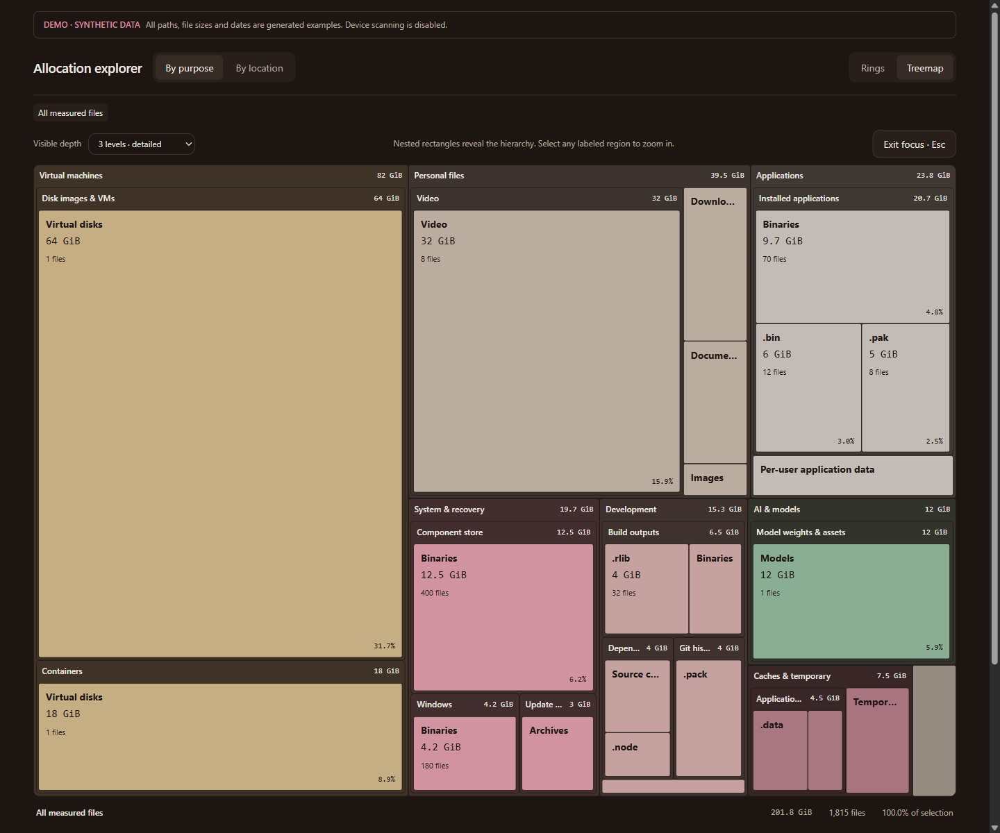

# Disk Atlas

Read-only disk usage analysis with a local browser interface. Inspect allocated
space by folder, category and file, then review large cleanup candidates.

Python 3.12+ · Standard library only · MIT licensed



*The screenshot uses `--demo`. All paths, filenames, sizes and timestamps are
generated examples, not a scan of a real device.*

## Run

From the repository directory:

```powershell
python server.py
```

Open **http://127.0.0.1:8765/?theme=dark** and select **Scan drives**.
The server does not scan automatically. To start a scan on launch:

```powershell
python server.py --scan
```

Keep the terminal open. Press **Ctrl+C** to stop the server; closing the browser
does not stop it. `Start-DiskAtlas.ps1` is an alternative Windows launcher.

### Try the demo without scanning

```powershell
python server.py --demo
```

Demo mode uses deterministic, fictional metadata in a temporary directory.
It does not enumerate real drives or scan your files, and scan requests are
rejected by the server. Use `--port 8766` to run it beside another instance.

On macOS or Linux, use `python3` if that is your Python 3 command.

## Platform status

| Platform | Status |
| --- | --- |
| Windows 10/11 | Primary target for full-drive scanning, allocation accounting and cleanup guidance. |
| macOS/Linux | Synthetic demo supported. Real scanning has an experimental Unix fallback, not equivalent platform support. |

The Unix fallback scans the root filesystem rather than discovering every
volume. Classification and cleanup guidance remain Windows-oriented. APFS
clones, snapshots, firmlinks and other shared storage are not fully accounted
for; mounted or mirrored paths can also affect totals.
Passing unit tests on another OS does not establish full scanning support.

### Testing on a Mac

Start with the synthetic demo:

```sh
python3 --version  # 3.12 or newer
python3 server.py --demo
```

Open `http://127.0.0.1:8765/?theme=dark&chart=map`. For an experimental real
scan, stop the demo and run `python3 server.py`, then start a scan in the UI.

macOS may deny access to protected directories. Those failures should appear
in the coverage view; the app does not grant itself Full Disk Access or bypass
permissions. Treat APFS allocation totals and Windows-oriented cleanup
recommendations as limitations to investigate, not verified Mac behavior.

## Explore a scan

- **By purpose:** category → subcategory → file type → individual files.
- **By location:** drive → folder → subfolder → individual files.
- **Rings:** compare several hierarchy levels at once.
- **Treemap:** a full-width nested map with 1–3 levels, hover details and
  click-to-drill navigation. **Focus map** expands the view; **Escape** exits.
- **Largest files:** filter by filename or path and inspect allocated versus
  logical size.
- **Cleanup recommendations:** review candidates of at least 256 MiB, with
  filters for 512 MiB, 1 GiB and 5 GiB.

Recommendations include exact paths, prerequisites, risks and a suggested
manual approach. Candidate sizes are **not guaranteed savings**. An entire
VM image, for example, is not an estimate of unused space inside that VM.
The app does not delete files, uninstall software or execute cleanup commands.

## What “unaccounted” means

```text
Windows-reported used space − measured file allocation = unaccounted space
```

The gap can include inaccessible directories, locked system files, skipped
reparse points or cloud placeholders, filesystem metadata, alternate data
streams, the inventory database itself and changes during the scan.

**Unaccounted does not mean removable.** The app does not present that gap as
potential cleanup savings. The coverage view lists exclusions and errors.

## Privacy and local storage

The server binds to `127.0.0.1`, validates Host/Origin headers and requires a
per-process token for API requests. It loads no third-party scripts or fonts
and sends no telemetry. This is a single-user local utility, not a network
service.

Real inventories contain sensitive metadata: full paths, file sizes, types and
modification times. **They are not anonymous or encrypted.** The app reads
metadata, not file contents, and does not hash files or hydrate cloud files.

Runtime data is stored **outside the repository** by default:

| Platform | Default directory |
| --- | --- |
| Windows | `%LOCALAPPDATA%\DiskAtlas` |
| macOS | `~/Library/Application Support/DiskAtlas` |
| Linux | `$XDG_STATE_HOME/disk-atlas`, or `~/.local/state/disk-atlas` |

Use `--data-dir PATH` to select another private location. Avoid shared, synced
or source-controlled directories. Large scans can produce a substantial
SQLite database; storage grows with the number and length of inventoried paths.

- `inventory.sqlite` contains the last saved scan.
- `scanning.sqlite` contains working data during a scan.
- `recommendations.json` caches candidates for that snapshot.
- Exported summaries can include full candidate paths after recommendations
  have been loaded. Review them before sharing.

The repository excludes runtime databases, exports, logs, bytecode and
non-demo screenshots. Do not attach real scans or screenshots to public issues.
`.gitignore` does not anonymize exports or remove data already committed.

## Accounting and limitations

On Windows, the scanner uses `GetCompressedFileSizeW` for allocated size,
`os.stat` for file identity and `GetDiskFreeSpaceExW` for volume usage.

- Hard-linked allocation is counted once, under the first encountered path.
  Logical sizes still count individual directory entries.
- Allocation lookup failures are recorded, not replaced with guessed sizes.
- Junctions, symlinks and other reparse points are skipped.
- The app does not request elevation or bypass permissions.
- VM/container images are measured as host files, not inspected internally.
- Classification is heuristic: path rules take precedence over extensions.
- Last modified is not last accessed; an old file may still be needed.
- The scan is live, not an atomic snapshot or forensic accounting tool.
- Mounted-folder targets, unmounted partitions, removable and network drives
  are outside the Windows fixed-drive scan.

Rescanning replaces the saved snapshot after completion. Stopping a scan saves
a clearly labeled partial snapshot. A failed scan retains the previous one.

## Development

The backend and tests need no Python packages. Node.js 20+ is needed only for
the standalone treemap geometry test, not to run the application.

```powershell
python -m unittest discover -s . -p "test_*.py" -v
node test_treemap.cjs
python scripts/check_release.py
```

The release check inspects Git-indexed files for runtime artifacts, personal
home paths, common credential patterns and screenshot metadata. It is a
guardrail, not a substitute for reviewing what you publish.

| File | Purpose |
| --- | --- |
| `scanner.py` | Metadata inventory, allocation accounting and read-only queries |
| `recommendations.py` | Cleanup candidate rules |
| `server.py` | Loopback HTTP server and command-line options |
| `index.html` | Browser UI and visualizations |
| `demo.py` | Synthetic metadata generator |

See [CONTRIBUTING.md](CONTRIBUTING.md) for change and screenshot guidelines.

## License

[MIT](LICENSE).
